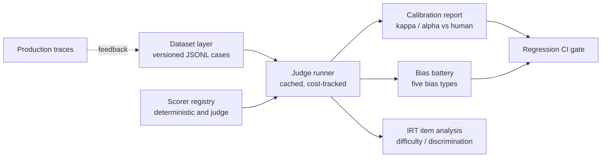

# judgekit

Evaluate your evaluators.

judgekit is a calibration and agent-trajectory evaluation platform whose headline metric is
judge-vs-human validity rather than judge-vs-judge agreement. Most eval tooling measures whether
an LLM judge is consistent with other judges. That is the wrong question: a judge can agree with
other judges while drifting well away from human judgment. judgekit treats a judge as an untrusted
measurement instrument until it has been calibrated against human labels, and it ships the
instruments needed to prove that calibration: a five-type bias battery, item-response-theory
analysis of eval items, and trajectory-aware agent scoring, all wired to a regression gate that
drops into CI.

## Status

The first release has shipped: the dataset schema, the deterministic scorers, and `judgekit run`.
The statistical core shipped on top of it: `judgekit calibrate` computes Cohen's kappa and
Krippendorff's alpha (nominal, ordinal, interval) against human labels, with bootstrap confidence
intervals. The judge runner has now shipped on top of that: `judgekit judge` runs a versioned judge
config against a dataset behind a provider-agnostic interface (Anthropic and OpenAI-compatible),
with a content-addressed response cache, per-call token and cost accounting, and a hard
`--max-cost` ceiling. Judge verdicts feed `judgekit calibrate` as raters. Next up is calibration
studies with locked rubrics and an explicit "unknown" option. See Roadmap for the rest of the
milestone plan.

## Architecture



## Why this exists

- Judges can agree with one another while diverging from human judgment. Variance compression and
  surface-quality inflation are documented effects, not hypotheticals
  ([Reliability without Validity](https://arxiv.org/pdf/2606.19544)).
- In production bias tests, judge error exceeds 50% even when controlled-setting agreement looks
  like roughly 85%. Agreement is not validity
  ([LLM-as-judge reliability](https://www.adaline.ai/blog/llm-as-a-judge-reliability-bias)).
- The credible way to run evals is error-analysis-first and human-calibration-first
  ([evals FAQ, Husain and Shankar](https://hamel.dev/blog/posts/evals-faq/)). judgekit builds that
  discipline into the tooling instead of leaving it to convention.

## What the first release delivers

- A versioned JSONL dataset schema (input, reference, human label, metadata slices) validated by
  pydantic models, with a content-addressed `dataset_version` (a sha256 hash over the case set).
- Deterministic scorers (exact, regex, structured) behind a `judgekit run` command. Zero model
  calls; cost is recorded as 0.0 on every result.
- Append-only JSONL run artifacts: a manifest line (run id, dataset version, scorer, numeric
  summary) followed by one traced `RunResult` line per case.

## What the statistical core adds

- `judgekit calibrate` compares one or more rater label files (JSONL, `case_id` + `label`) against
  a dataset's human labels.
- Cohen's kappa, percent agreement, and confusion matrices (overall and per metadata slice) for a
  single rater vs. human; Krippendorff's alpha for any number of raters, with missing data handled.
- 95% bootstrap confidence intervals, seeded so reports are reproducible - the seed and resample
  count used are recorded in the report artifact.
- A single JSON report artifact that cites the exact `dataset_version`, with n accounting
  (`n_cases` / `n_labeled` / `n_used`) so shrinking coverage is always visible.

## What the judge runner adds

- `judgekit judge` executes a judge config (id, rubric, labels, model, params) against a dataset
  through a provider-agnostic interface: Anthropic (native Messages API) and OpenAI-compatible
  (configurable base_url - OpenAI, vLLM, Ollama, gateways) providers, hand-rolled on httpx with
  bounded exponential backoff, Retry-After support, and fail-fast on non-retryable errors.
- Judge configs are versioned by a content hash over behavior fields only (id, labels, model,
  params, rubric); operational settings (pricing, timeouts, retries, base_url) are deliberately
  excluded, so an ops edit never invalidates a calibration result.
- Responses are cached keyed on (config hash, case content hash) - never the case id - and each
  verdict is written to the cache the moment it completes, so an aborted run's spend is preserved
  and a rerun resumes from cache hits. `--max-cost` is a hard ceiling checked before every live
  call; token usage is required from providers (missing usage is an error, not a zero), and cost
  is computed from user-declared per-MTok pricing in the config - there is no baked-in price table
  to go stale.
- A judge run artifact is itself a rater: pass it to `judgekit calibrate --ratings` and the judge's
  verdicts are scored against the dataset's human labels (kappa/alpha), with the rater named by
  the config id.
- The model must answer with a JSON verdict naming one of the config's labels; malformed or
  out-of-set replies get a bounded number of re-asks (attempts and their cost are recorded), then
  the run aborts loudly.

## Quickstart

```bash
uv run judgekit run --dataset examples/exact/cases.jsonl --outputs examples/exact/outputs.jsonl --scorer exact
uv run judgekit run --dataset examples/regex/cases.jsonl --outputs examples/regex/outputs.jsonl --scorer regex
uv run judgekit run --dataset examples/structured/cases.jsonl --outputs examples/structured/outputs.jsonl --scorer structured
```

Each run writes its artifact to `runs/<run_id>.jsonl` by default (pass `--out` to choose the path)
and prints a summary, for example:

```
run_id          f256b44ca6014509a2cd031200804a87
dataset_version sha256:ca0bf0709f3afd4f9ef3d1ee2fcd5e32253624bdb5cbc5473caf6523b6b3f600
scorer          exact
n_cases         8
mean_score      0.7500
pass_rate       0.7500
artifact        runs/f256b44ca6014509a2cd031200804a87.jsonl
```

Exit codes: 0 = run completed (scores are measurements, not gates), 1 = data or validation errors
(dataset and outputs problems are reported with line numbers), 2 = usage errors.

`judgekit calibrate` compares rater label files against a dataset's human labels:

```bash
uv run judgekit calibrate --dataset examples/calibration/cases.jsonl --ratings examples/calibration/judge_strong.jsonl
uv run judgekit calibrate --dataset examples/calibration/cases.jsonl --ratings examples/calibration/judge_weak.jsonl
uv run judgekit calibrate --dataset examples/calibration/cases.jsonl --ratings examples/calibration/judge_strong.jsonl --ratings examples/calibration/judge_weak.jsonl
```

Cohen's kappa is only defined for a single rater against the human anchor, so the two single-rater
commands above each report a kappa line; the multi-rater command passes two `--ratings` files and
reports alpha only (no kappa). The strong judge's run prints:

```
report_id       55446c6c7dba43ec8a5b6630faa3475f
dataset_version sha256:e925f537554ebade2f32a951ab1c003f72664a2d77cbed3113e7c615693f2afc
level           nominal
n_cases         10
n_labeled       9
kappa           0.7500 [0.1579, 1.0000] (n=8)
alpha           0.7619 [0.0000, 1.0000] (n=8)
artifact        reports/55446c6c7dba43ec8a5b6630faa3475f.json
```

The weak judge agrees with the human labels barely above chance: its kappa comes out to 0.1429,
clearly below the strong judge's 0.7500.

The repo also ships a judge config for the same support-ticket dataset, plus a recorded response
cache from a real Claude Haiku 4.5 run, so the full judge pipeline replays offline at zero cost:

```bash
uv run judgekit judge --dataset examples/calibration/cases.jsonl --config examples/judge/support_quality.json --cache-dir examples/judge/cache --max-cost 0 --out runs/judge-demo.jsonl
```

```
run_id          LIVE_RUN_ID
dataset_version sha256:e925f537554ebade2f32a951ab1c003f72664a2d77cbed3113e7c615693f2afc
judge_config    support-quality-v1
config_hash     LIVE_CONFIG_HASH
model           claude-haiku-4-5-20251001
n_cases         10
n_cached        10
n_live          0
input_tokens    LIVE_INPUT_TOKENS
output_tokens   LIVE_OUTPUT_TOKENS
cost            0.000000
artifact        runs/judge-demo.jsonl
```

Every verdict came from the committed cache, `--max-cost 0` proves no money can move, and the same
command with an `ANTHROPIC_API_KEY` set and a cold cache performs the real run.

Feeding the judge to calibrate works exactly like the strong/weak judge files above:

```bash
uv run judgekit calibrate --dataset examples/calibration/cases.jsonl --ratings runs/judge-demo.jsonl
```

```
report_id       LIVE_REPORT_ID
dataset_version sha256:e925f537554ebade2f32a951ab1c003f72664a2d77cbed3113e7c615693f2afc
level           nominal
n_cases         10
n_labeled       9
kappa           LIVE_KAPPA_LINE
alpha           LIVE_ALPHA_LINE
artifact        reports/LIVE_REPORT_ID.json
```

This is the point of the tool: the judge's verdicts are scored against human labels, and the rater
is named by the config id (`support-quality-v1`), not the file stem.

The recorded cache came from a live run:

```bash
ANTHROPIC_API_KEY=... uv run judgekit judge --dataset examples/calibration/cases.jsonl --config examples/judge/support_quality.json --max-cost 0.01
```

The recorded 10-case run cost LIVE_COST_FIGURE (LIVE_INPUT_TOKENS input / LIVE_OUTPUT_TOKENS output
tokens at $1/$5 per MTok for Claude Haiku 4.5); `--max-cost` caps spend, and the cache directory
defaults to `.judgekit/cache`.

## Roadmap

1. Dataset schema, deterministic scorers, and CLI. (shipped)
2. Statistical core: kappa and alpha with confidence intervals. (shipped)
3. Judge runner: provider-agnostic interface, response caching, per-run cost tracking. (shipped)
4. Calibration studies against human labels, with locked rubrics and an explicit "unknown" option.
5. Five-type bias battery: position, verbosity, self-preference, format, calibration drift.
6. Regression gate for CI.
7. Trajectory evaluator: outcome and policy scoring over agent runs, reported as pass@k and pass^k.
8. Trace ingestion, dashboard, and the trace-to-dataset feedback loop.

## Development

```bash
uv sync
make check   # lint, typecheck, test
```

Individual targets: `make lint`, `make format`, `make typecheck`, `make test`, `make docker-build`.

The CLI installs as the `judgekit` entry point; check it with `uv run judgekit --version`.

## License

Apache-2.0. See [LICENSE](LICENSE).
