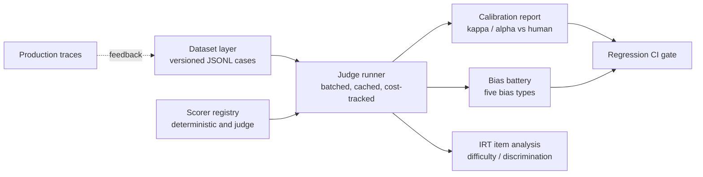

# judgekit

Evaluate your evaluators.

judgekit is a calibration and agent-trajectory evaluation platform whose headline metric is
judge-vs-human validity rather than judge-vs-judge agreement. Most eval tooling measures whether
an LLM judge is consistent with other judges. That is the wrong question: a judge can agree with
other judges while drifting well away from human judgment. judgekit treats a judge as an untrusted
measurement instrument until it has been calibrated against human labels, and it ships the
instruments needed to prove that calibration: a five-type bias battery, item-response-theory
analysis of eval items, and trajectory-aware agent scoring, all wired to a regression gate that
drops into CI.

## Status

Early stage. The design is complete and implementation proceeds milestone by milestone (see
Roadmap). The current focus is the dataset schema, deterministic scorers, and the statistical
core, none of which require a live model.

## Architecture



## Why this exists

- Judges can agree with one another while diverging from human judgment. Variance compression and
  surface-quality inflation are documented effects, not hypotheticals
  ([Reliability without Validity](https://arxiv.org/pdf/2606.19544)).
- In production bias tests, judge error exceeds 50% even when controlled-setting agreement looks
  like roughly 85%. Agreement is not validity
  ([LLM-as-judge reliability](https://www.adaline.ai/blog/llm-as-a-judge-reliability-bias)).
- The credible way to run evals is error-analysis-first and human-calibration-first
  ([evals FAQ, Husain and Shankar](https://hamel.dev/blog/posts/evals-faq/)). judgekit builds that
  discipline into the tooling instead of leaving it to convention.

## What the first release delivers

- A versioned JSONL dataset schema (input, reference, human label, slices) validated by pydantic
  models.
- Deterministic scorers (exact, regex, structured-diff) behind a `judgekit run` command, with no
  model required for this slice.
- A statistical core (Cohen's kappa, Krippendorff's alpha) tested against known fixtures,
  producing the report objects every later component builds on.
- A `judgekit gate` command that compares a run against a baseline with a statistical test and
  exits nonzero in CI on a real regression.

## Roadmap

1. Dataset schema, deterministic scorers, and CLI.
2. Statistical core: kappa and alpha with confidence intervals.
3. Judge runner: provider-agnostic interface, response caching, per-run cost tracking.
4. Calibration studies against human labels, with locked rubrics and an explicit "unknown" option.
5. Five-type bias battery: position, verbosity, self-preference, format, calibration drift.
6. Regression gate for CI.
7. Trajectory evaluator: outcome and policy scoring over agent runs, reported as pass@k and pass^k.
8. Trace ingestion, dashboard, and the trace-to-dataset feedback loop.

## Development

```bash
uv sync
make check   # lint, typecheck, test
```

Individual targets: `make lint`, `make format`, `make typecheck`, `make test`, `make docker-build`.

## License

Apache-2.0. See [LICENSE](LICENSE).
